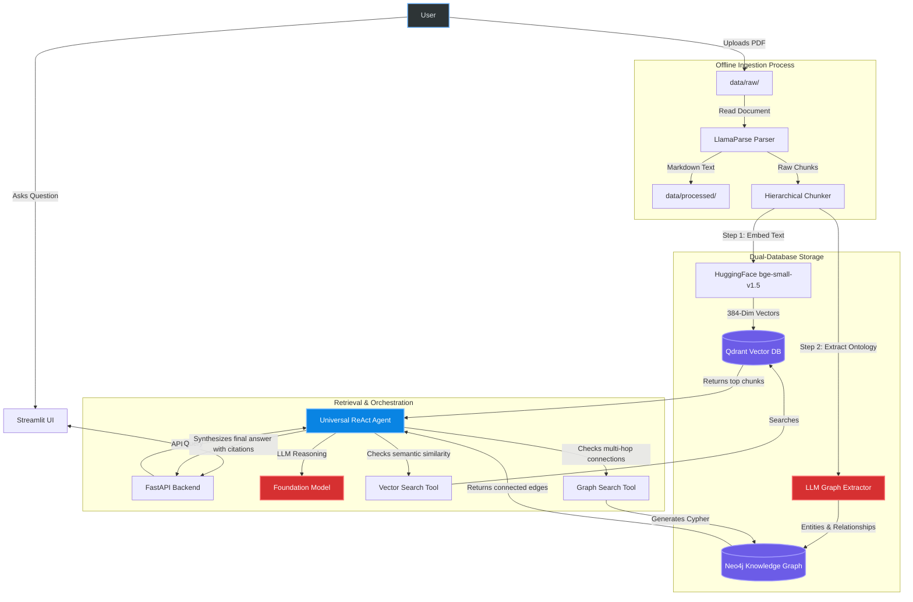

# Agentic-RAG

Universal Agentic Retrieval-Augmented Generation system that ingests PDFs, builds both vector and knowledge-graph indexes, and answers questions with tool-driven reasoning and citations.

## Why This Project
Most RAG systems rely on vector search alone. This system combines vector similarity search with Neo4j knowledge graph traversal, enabling multi-hop reasoning and citation-backed responses that single-index RAG cannot achieve.

## Features
- LlamaParse → structured Markdown parsing (tables preserved)
- Hierarchical chunking with rich metadata
- Dual storage: Qdrant (vector) + Neo4j (graph)
- LangGraph ReAct agent with `vector_search` and `graph_search` tools
- FastAPI backend + Streamlit UI
- Optional Celery + Redis async ingestion

## Tech Stack
| Layer | Technology |
|-------|------------|
| PDF Parsing | LlamaParse |
| Embeddings | HuggingFace bge-small-v1.5 |
| Vector DB | Qdrant |
| Graph DB | Neo4j |
| Agent | LangGraph ReAct |
| LLM | Gemini 2.5 Pro / OpenAI / Anthropic |
| Backend | FastAPI |
| UI | Streamlit |
| Async Queue | Celery + Redis |

## Architecture



## Quickstart

### 1. Install dependencies
```bash
python -m venv .venv
source .venv/bin/activate
pip install -r requirements.txt
```

### 2. Configure environment
```bash
cp .env.example .env
```

Update `.env` with your own credentials. Minimum required for a full run:
- `LLAMA_CLOUD_API_KEY` (PDF parsing)
- `GEMINI_API_KEY` (default agent + graph extraction)  
  *(or `OPENAI_API_KEY` / `ANTHROPIC_API_KEY` if you switch providers)*
- `QDRANT_URL` (defaults to `http://localhost:6333`)
- `NEO4J_URI`, `NEO4J_USERNAME`, `NEO4J_PASSWORD`, `NEO4J_DATABASE`

### 3. Start dependencies
```bash
docker-compose up -d
```

This brings up **Qdrant** and **Redis**. Run **Neo4j** separately (AuraDB or local install) and point the `NEO4J_*` env vars to it.

### 4. Ingest documents
Place PDFs in `data/raw/`, then run:
```bash
python ingest_all.py
```

The pipeline parses PDFs, chunks them, extracts a knowledge graph, ingests into Qdrant + Neo4j, and moves processed files to `data/processed/`.

### 5. Run the API
```bash
python main.py
```

FastAPI serves:
- `GET /` → health message
- `POST /chat` → agent response

### 6. Run the UI
```bash
streamlit run ui/app.py
```

The Streamlit app calls `http://127.0.0.1:8000/chat`.

## Async ingestion (optional)
If you want background ingestion with Celery:
```bash
celery -A worker.app worker --loglevel=info
python submit_ingestion_jobs.py
```

## Project structure
```
ingestion/        LlamaParse, chunking, graph extraction
retrieval/        LangGraph agent + tools
storage/          Qdrant and Neo4j managers
ui/               Streamlit frontend
main.py           FastAPI backend
ingest_all.py     End-to-end ingestion pipeline
worker.py         Celery worker for async ingestion
```

## Tests (manual scripts)
```bash
python test_ingestion.py
python test_storage.py
python test_agent.py
```
